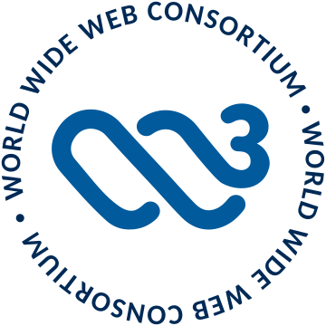

***
**Browse the schemas at [https://schemas.sourcemeta.com/sourcemeta/std](https://schemas.sourcemeta.com/sourcemeta/std)**
***

Building professional OpenAPI specifications demands precision, but mastering
JSON Schema is hard. This library eliminates that burden by providing
production-ready schemas that encode industry standards and best practices.
*Reference them directly in your API specifications and focus on what matters:
designing great APIs.*

> Led and maintained by a member of the JSON Schema Technical Steering Committee

**Use this library to:**

- Build production-grade OpenAPI specifications without writing schemas from scratch
- Skip the JSON Schema learning curve while maintaining expert-level quality
- Meet compliance and regulatory requirements with standards-based validation
- Establish a solid foundation for your organisation's API governance program

> [!WARNING]
> This project is in its early stages with much more to come. We need your
> feedback to shape its future. Please [share your thoughts and
> suggestions](https://github.com/sourcemeta/std/issues) on what you would like
> to see.

> [!NOTE]
> All schemas target JSON Schema 2020-12, the dialect used by OpenAPI v3.1 and
> later. Earlier JSON Schema dialects will be supported in the future.

## Standards Covered

| Organisation | Standard | Title |
|---|---|---|
|  | [IEEE Std 754-2019](https://ieeexplore.ieee.org/document/8766229) | [IEEE Standard for Floating-Point Arithmetic](https://ieeexplore.ieee.org/document/8766229) |
|  | [IEEE Std 1003.1-2017](https://pubs.opengroup.org/onlinepubs/9699919799/) | [IEEE Standard for Information Technology—Portable Operating System Interface (POSIX)](https://pubs.opengroup.org/onlinepubs/9699919799/) |
|  | [RFC 3066](https://www.rfc-editor.org/rfc/rfc3066) | [Tags for the Identification of Languages](https://www.rfc-editor.org/rfc/rfc3066) |
|  | [RFC 3986](https://www.rfc-editor.org/rfc/rfc3986) | [Uniform Resource Identifier (URI): Generic Syntax](https://www.rfc-editor.org/rfc/rfc3986) |
|  | [RFC 4648](https://www.rfc-editor.org/rfc/rfc4648) | [The Base16, Base32, and Base64 Data Encodings](https://www.rfc-editor.org/rfc/rfc4648) |
|  | [RFC 4918](https://www.rfc-editor.org/rfc/rfc4918) | [HTTP Extensions for Web Distributed Authoring and Versioning (WebDAV)](https://www.rfc-editor.org/rfc/rfc4918) |
|  | [RFC 5322](https://www.rfc-editor.org/rfc/rfc5322) | [Internet Message Format](https://www.rfc-editor.org/rfc/rfc5322) |
|  | [RFC 5646](https://www.rfc-editor.org/rfc/rfc5646) | [Tags for Identifying Languages (BCP 47)](https://www.rfc-editor.org/rfc/rfc5646) |
|  | [RFC 5789](https://www.rfc-editor.org/rfc/rfc5789) | [PATCH Method for HTTP](https://www.rfc-editor.org/rfc/rfc5789) |
|  | [RFC 6901](https://www.rfc-editor.org/rfc/rfc6901) | [JavaScript Object Notation (JSON) Pointer](https://www.rfc-editor.org/rfc/rfc6901) |
|  | [RFC 7807](https://www.rfc-editor.org/rfc/rfc7807) | [Problem Details for HTTP APIs](https://www.rfc-editor.org/rfc/rfc7807) |
|  | [RFC 7946](https://www.rfc-editor.org/rfc/rfc7946) | [The GeoJSON Format](https://www.rfc-editor.org/rfc/rfc7946) |
|  | [RFC 8141](https://www.rfc-editor.org/rfc/rfc8141) | [Uniform Resource Names (URNs)](https://www.rfc-editor.org/rfc/rfc8141) |
|  | [RFC 9110](https://www.rfc-editor.org/rfc/rfc9110) | [HTTP Semantics](https://www.rfc-editor.org/rfc/rfc9110) |
|  | [ISO 3166-1:2020](https://www.iso.org/iso-3166-country-codes.html) | [Codes for the representation of names of countries and their subdivisions](https://www.iso.org/iso-3166-country-codes.html) |
|  | [ISO 4217:2015](https://www.iso.org/iso-4217-currency-codes.html) | [Codes for the representation of currencies and funds](https://www.iso.org/iso-4217-currency-codes.html) |
|  | [ISO 6709:2022](https://www.iso.org/standard/75147.html) | [Standard representation of geographic point location by coordinates](https://www.iso.org/standard/75147.html) |
|  | [ISO 639:2023](https://www.iso.org/iso-639-language-code) | [Codes for the representation of names of languages](https://www.iso.org/iso-639-language-code) |
|  | [ISO 8601-1:2019](https://www.iso.org/standard/70907.html) | [Date and time — Representations for information interchange — Part 1: Basic rules](https://www.iso.org/standard/70907.html) |
|  | [ISO 8601-2:2019](https://www.iso.org/standard/70908.html) | [Date and time — Representations for information interchange — Part 2: Extensions](https://www.iso.org/standard/70908.html) |
|  | [ISO 80000-1:2022](https://www.iso.org/standard/76921.html) | [Quantities and units — Part 1: General](https://www.iso.org/standard/76921.html) |
|  | [ISO/IEC 2382:2015](https://www.iso.org/standard/63598.html) | [Information technology — Vocabulary](https://www.iso.org/standard/63598.html) |
|  | [ISO/IEC 9899:2024](https://www.iso.org/standard/82075.html) | [Programming languages — C](https://www.iso.org/standard/82075.html) |
|  | [BIPM SI 2019](https://www.bipm.org/en/publications/si-brochure) | [The International System of Units (SI) — 9th edition (2019)](https://www.bipm.org/en/publications/si-brochure) |
| **JSON-RPC** | [JSON-RPC 2.0](https://www.jsonrpc.org/specification) | [JSON-RPC 2.0 Specification](https://www.jsonrpc.org/specification) |
|  | [XML Schema Part 2](https://www.w3.org/TR/xmlschema-2/) | [XML Schema Datatypes Second Edition](https://www.w3.org/TR/xmlschema-2/) |
|  | [XBRL 2.1](https://www.xbrl.org/Specification/XBRL-2.1/REC-2003-12-31/XBRL-2.1-REC-2003-12-31+corrected-errata-2013-02-20.html) | [Extensible Business Reporting Language (XBRL) 2.1](https://www.xbrl.org/Specification/XBRL-2.1/REC-2003-12-31/XBRL-2.1-REC-2003-12-31+corrected-errata-2013-02-20.html) |
|  | [XBRL DTR](https://www.xbrl.org/dtr/dtr.html) | [XBRL Data Types Registry](https://www.xbrl.org/dtr/dtr.html) |
|  | [XBRL UTR](https://www.xbrl.org/specification/utr/rec-2013-11-18/utr-rec-2013-11-18-clean.html) | [XBRL Units Type Registry](https://www.xbrl.org/specification/utr/rec-2013-11-18/utr-rec-2013-11-18-clean.html) |

## :mortar_board: Citing

If you use this library in your research or project, please cite it using the
DOI provided above. You can find citation information in various formats
(BibTeX, APA, etc.) by clicking the "Cite as" button on the [Zenodo
record](https://doi.org/10.5281/zenodo.17526561).

## :page_facing_up: License

While the project is publicly available on GitHub, it operates under a
[source-available license](https://github.com/sourcemeta/std/blob/main/LICENSE)
rather than a traditional open-source model. You may freely use these schemas
for non-commercial purposes, but commercial use requires a [paid commercial
license](https://www.sourcemeta.com/products/std#pricing).

*We are happy to discuss OEM and white-label distribution options for
incorporating these schemas into commercial products*.

## :handshake: Contributing

We welcome contributions! By sending a pull request, you agree to our
[contributing
guidelines](https://github.com/sourcemeta/.github/blob/main/CONTRIBUTING.md).
Meaningful contributions to this repository can be taken into consideration
towards a discounted (or even free) commercial license.

> [!TIP]
> Do you want to level up your JSON Schema skills? Check out
> [learnjsonschema.com](https://www.learnjsonschema.com), our growing JSON
> Schema documentation website, our [JSON Schema for
> OpenAPI](https://www.sourcemeta.com/courses/jsonschema-for-openapi) video
> course, and our O'Reilly book [Unifying Business, Data, and Code: Designing
> Data Products with JSON
> Schema](https://www.oreilly.com/library/view/unifying-business-data/9781098144999/).

## :email: Contact

If you have any questions or comments, don't hesitate in opening a ticket on
[GitHub Discussions](https://github.com/sourcemeta/std/discussions) or writing
to us at [hello@sourcemeta.com](mailto:hello@sourcemeta.com).
